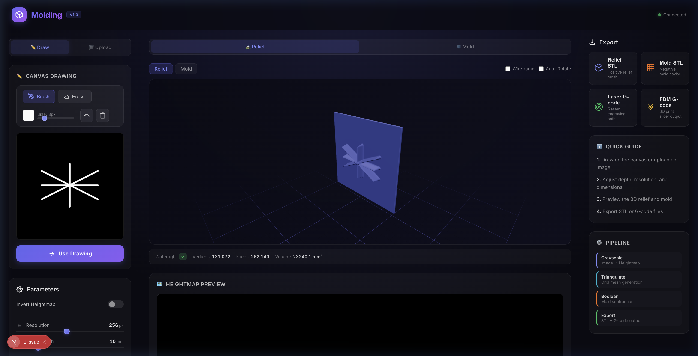
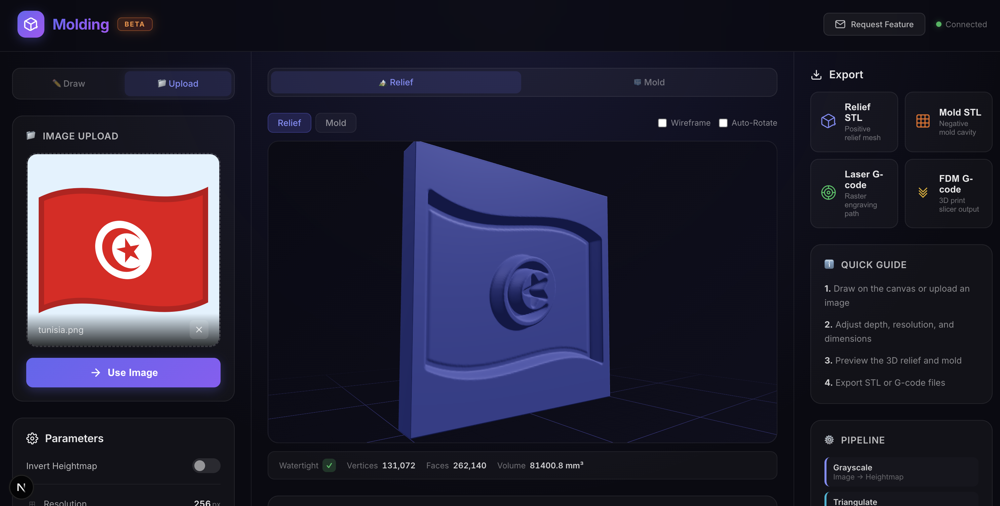
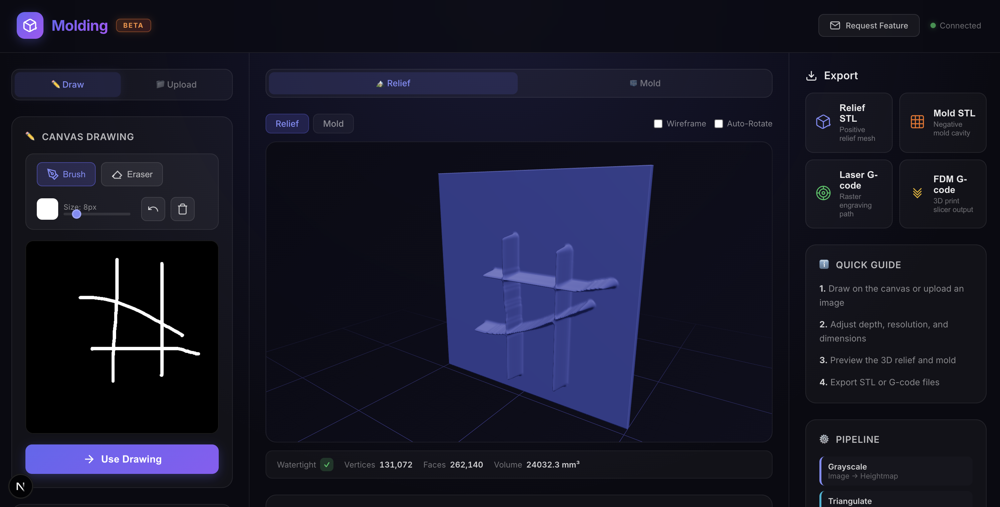
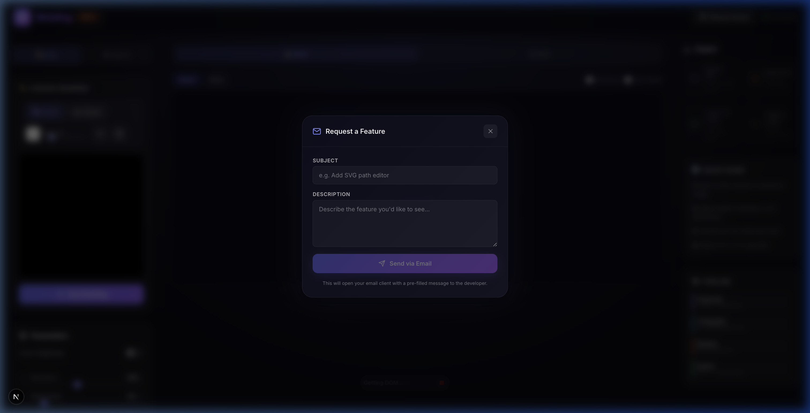
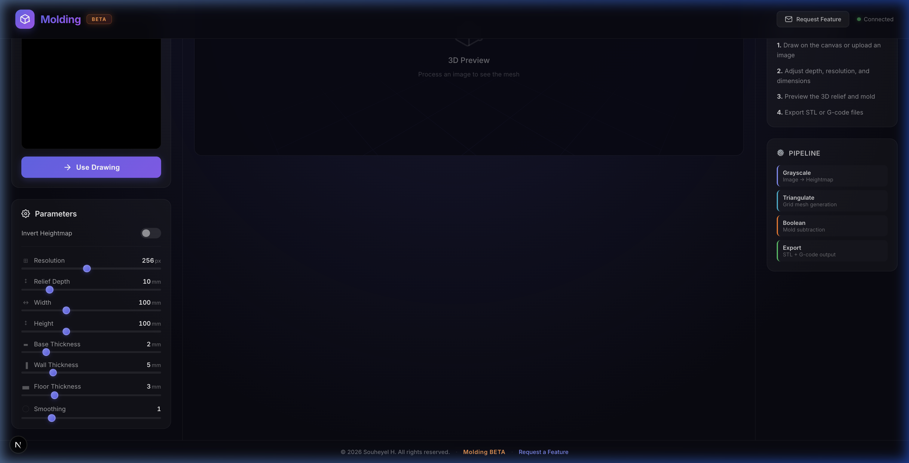

<p align="center">
  
</p>

<h1 align="center">🔧 Molding</h1>

<p align="center">
  <strong>Canvas → STL → G-code</strong><br>
  Automated Mold Generation for Laser Engraving & FDM 3D Printing
</p>

<p align="center">
  
  
  
  
  
</p>

---

## ⚡ Why this exists

I built this because I got **bored of doing a simple repetitive task manually**.

Turning a design into a usable mold should not require:

* opening CAD software
* manually extruding shapes
* fixing meshes
* exporting formats
* slicing again and again

It's slow, error-prone, and honestly unnecessary in 2026.

So I decided to build a system that does **everything automatically**.

> ⚠️ This project may look simple from the outside, but it actually requires **a lot of engineering work**: geometry processing, mesh generation, manufacturing constraints, G-code logic, and performance optimization.

---

## 🧠 What this project does

A **plug-and-play web application** that converts any 2D input into machine-ready output:

```
Canvas / Image / SVG
        ↓
    Heightmap
        ↓
   3D Geometry
        ↓
  Negative Mold
        ↓
  STL + G-code
```

No CAD. No manual steps. No friction.

---

## 🚀 Core Features

### 🎨 Input
* Draw directly on canvas (brush + eraser)
* Upload images (PNG, JPG, WebP, BMP)
* Import SVG files
* Drag-and-drop support

### 🧩 Geometry Engine
* Grayscale → heightmap conversion
* Parametric depth control
* Grid-based mesh triangulation
* Watertight STL output guaranteed

### 🧱 Mold Generation
* Automatic negative cavity creation via boolean subtraction
* Adjustable base thickness + wall margins
* Floor thickness control for structural integrity

### 🖨️ Output
* **STL** → binary export for both relief and mold
* **G-code** for:
  * FDM printers (via CuraEngine CLI / fallback slicer)
  * Laser engravers (raster scan with grayscale → power modulation)

### 👀 Live Preview
* Real-time Three.js 3D viewer
* Orbit controls, wireframe mode, auto-rotate
* Heightmap 2D preview
* Mesh diagnostics (vertex count, face count, watertight status, volume)

---

## 🔎 Preview





<details>
<summary>More screenshots</summary>

### Feature Request Modal


### Footer & BETA Badge


</details>

---

## ⚙️ How it works (technical)

### 1. Heightmap generation

Each pixel becomes a Z value:

```
Z(x,y) = depth × grayscale(x,y)
```

The image is converted to grayscale, normalized to `[0, 1]`, optionally smoothed with a Gaussian filter, then scaled by the target depth.

### 2. Mesh construction

* Grid-based triangulation over the heightmap
* Vertex displacement using Z values
* Side walls + bottom face sealing
* Result: **watertight mesh** every time

### 3. Mold inversion

```
Z_mold = base_height − Z(x,y)
```

Boolean subtraction creates a **negative cavity** suitable for casting — with configurable wall thickness, floor thickness, and margins.

### 4. G-code generation

#### FDM
* STL → CuraEngine CLI → G-code
* Built-in fallback slicer if CuraEngine is not available

#### Laser
* Raster scan line by line
* Power modulation based on pixel intensity
* Configurable feed rate, max power, and resolution

---

## 🏗️ Architecture

```
┌─────────────────┐     ┌─────────────────┐     ┌─────────────────┐
│   Next.js        │     │   Node.js        │     │   Python         │
│   Frontend       │────▶│   API Server     │────▶│   Microservice   │
│   :3000          │     │   :3001          │     │   :5001          │
│                  │     │                  │     │                  │
│  • Canvas        │     │  • REST Routes   │     │  • Heightmap     │
│  • Three.js      │     │  • G-code Gen    │     │  • Mesh Gen      │
│  • Controls      │     │  • File Upload   │     │  • Boolean Ops   │
│  • Export UI     │     │  • Python Bridge │     │  • STL Export    │
└─────────────────┘     └─────────────────┘     └─────────────────┘
```

---

## 🚀 Quick Start

### Prerequisites

- **Node.js** 18+ and npm
- **Python** 3.10+ with pip

### ⚡ One-Click Launch (Recommended)

```bash
git clone https://github.com/souheyell/Molding.git
cd Molding
./start.sh
```

That's it. The script will:

1. ✅ Check all requirements (Node.js, Python, npm, pip)
2. ✅ Verify ports 3000, 3001, 5001 are available
3. ✅ Create a Python virtual environment (if needed)
4. ✅ Install all dependencies (Python + Node)
5. ✅ Start all 3 services in the correct order
6. ✅ Wait for health checks to confirm everything is running
7. ✅ Open your browser automatically

Press `Ctrl+C` to stop all services cleanly.

> 💡 **Windows users:** Run the script in Git Bash or WSL.

---

### 🔧 Manual Start (Advanced)

<details>
<summary>Click to expand manual setup steps</summary>

#### 1. Clone the repository

```bash
git clone https://github.com/souheyell/Molding.git
cd Molding
```

#### 2. Start the Python microservice

```bash
cd python-service
python3 -m venv venv
source venv/bin/activate        # On Windows: venv\Scripts\activate
pip install -r requirements.txt
python app.py                   # → http://localhost:5001
```

#### 3. Start the Node.js backend

```bash
cd backend
npm install
node server.js                  # → http://localhost:3001
```

#### 4. Start the frontend

```bash
cd frontend
npm install
npm run dev                     # → http://localhost:3000
```

Open **http://localhost:3000** in your browser.

</details>

---

## 📂 Project Structure

```
Molding/
├── start.sh                     # ⚡ One-click launcher
│
├── frontend/                    # UI (canvas + preview)
│   └── src/
│       ├── app/
│       │   ├── page.js          # Main application page
│       │   ├── layout.js        # Root layout + metadata
│       │   └── globals.css      # Design system + global styles
│       ├── components/
│       │   ├── Canvas/          # HTML5 drawing canvas
│       │   ├── Controls/        # Parameter sliders & toggles
│       │   ├── ExportPanel/     # STL & G-code download UI
│       │   ├── FileUpload/      # Drag-and-drop upload
│       │   └── Preview3D/       # Three.js 3D viewer
│       └── lib/
│           ├── api.js           # Backend API client
│           └── constants.js     # Default parameters
│
├── backend/                     # API (Node.js)
│   ├── server.js                # Entry point
│   ├── routes/
│   │   ├── process.js           # Heightmap/mesh/mold endpoints
│   │   ├── export.js            # STL download endpoints
│   │   └── gcode.js             # G-code generation endpoints
│   └── services/
│       ├── pythonBridge.js      # Python microservice HTTP client
│       └── gcodeGenerator.js    # Laser & FDM G-code generator
│
├── python-service/              # Geometry engine (Python)
│   ├── app.py                   # Flask API server
│   ├── requirements.txt         # Python dependencies
│   └── services/
│       ├── heightmap.py         # Image → normalized grayscale
│       ├── mesh_generator.py    # Grid triangulation
│       ├── mold_creator.py      # Boolean subtraction
│       └── stl_exporter.py      # Binary STL export
│
├── docs/screenshots/            # App screenshots
├── .gitignore
├── LICENSE
└── README.md
```

---

## 🧰 Tech Stack

### Frontend
* [Next.js 16](https://nextjs.org/) — React framework with Turbopack
* [Three.js](https://threejs.org/) + [@react-three/fiber](https://docs.pmnd.rs/react-three-fiber) — 3D rendering
* [@react-three/drei](https://github.com/pmndrs/drei) — OrbitControls, Grid, helpers
* HTML5 Canvas API — Drawing input

### Backend
* [Express.js](https://expressjs.com/) — REST API server
* [Multer](https://github.com/expressjs/multer) — File upload middleware
* [node-fetch](https://github.com/node-fetch/node-fetch) — HTTP client

### Geometry & Processing
* [Flask](https://flask.palletsprojects.com/) — Python web framework
* [NumPy](https://numpy.org/) — Heightmap computation
* [Pillow](https://pillow.readthedocs.io/) — Image processing
* [trimesh](https://trimsh.org/) — Mesh generation & boolean operations
* [SciPy](https://scipy.org/) — Gaussian blur filtering

### Toolchain
* CuraEngine (FDM slicing)
* Custom raster → G-code generator (laser)

---

## ⚙️ Configuration

### Environment Variables

| Variable | Default | Description |
|----------|---------|-------------|
| `PYTHON_SERVICE_URL` | `http://localhost:5001` | Python microservice URL |
| `PORT` (backend) | `3001` | Node.js server port |
| `FRONTEND_URL` | `http://localhost:3000` | CORS origin for frontend |
| `NEXT_PUBLIC_API_URL` | `http://localhost:3001` | Backend API URL for frontend |

### Processing Parameters

| Parameter | Range | Default | Unit |
|-----------|-------|---------|------|
| Resolution | 32 – 512 | 256 | px |
| Relief Depth | 1 – 50 | 10 | mm |
| Width | 10 – 300 | 100 | mm |
| Height | 10 – 300 | 100 | mm |
| Base Thickness | 0.5 – 10 | 2 | mm |
| Wall Thickness | 1 – 20 | 5 | mm |
| Floor Thickness | 1 – 10 | 3 | mm |
| Smoothing | 0 – 5 | 1.0 | σ |

---

## 📋 API Endpoints

### Processing
| Method | Endpoint | Description |
|--------|----------|-------------|
| `POST` | `/api/process` | Full pipeline (heightmap → mesh → mold) |
| `POST` | `/api/process/heightmap` | Generate heightmap only |
| `POST` | `/api/process/mesh` | Generate mesh from heightmap |
| `POST` | `/api/process/mold` | Generate mold from mesh |

### Export
| Method | Endpoint | Description |
|--------|----------|-------------|
| `POST` | `/api/export/stl/relief` | Download relief STL |
| `POST` | `/api/export/stl/mold` | Download mold STL |
| `POST` | `/api/export/heightmap` | Download heightmap image |

### G-code
| Method | Endpoint | Description |
|--------|----------|-------------|
| `POST` | `/api/gcode/laser` | Generate laser engraving G-code |
| `POST` | `/api/gcode/fdm` | Generate FDM printing G-code |

---

## ⚠️ Engineering Constraints

This system enforces:

* Minimum feature size
* Mesh integrity (watertight guaranteed)
* Depth limits for printability
* Valid geometry for manufacturing

---

## 🧪 Use Cases

* Silicone keychain molds
* Embossed surfaces
* Engraved plates
* Custom stamps
* Rapid prototyping

---

## 🔧 Hardware Compatibility

### Laser Engravers
* Diode lasers (5W – 40W+)
* CO₂ lasers

### FDM Printers
* Ender series
* Prusa
* Bambu Lab

---

## 🛠️ Roadmap

* Multi-material mold support
* Resin printer optimization
* Advanced smoothing algorithms
* GPU acceleration (WebGL compute)
* Multi-part mold generation

---

## 🧠 Philosophy

> Geometry should be generated, not designed.

If a machine can calculate it, you shouldn't have to model it.

---

## 🌍 Open & Free

This project is:

* **Free to use**
* **Free to modify**
* **Free to build on**

Anyone can take it, improve it, or adapt it to their workflow.

---

## 🤝 Contributing

Contributions are welcome:

* Geometry improvements
* Performance optimization
* UI/UX enhancements
* Machine profiles

Feel free to fork, open a PR, or use the **Request Feature** button in the app to email suggestions directly.

---

## 📄 License

MIT License — do whatever you want with it. See [LICENSE](LICENSE) for details.

---

## 💬 Final note

This started as solving something trivial.
It turned into building a full geometry pipeline.

If you use it, improve it, or break it — that's exactly the point.
